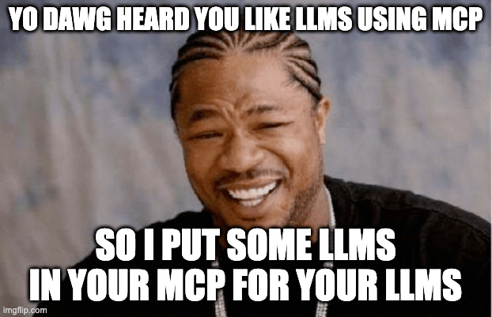

# MCP LLM
[](https://smithery.ai/server/@sammcj/mcp-llm)

An MCP server that provides access to LLMs using the LlamaIndexTS library.



## Features

This MCP server provides the following tools:

- `generate_code`: Generate code based on a description
- `generate_code_to_file`: Generate code and write it directly to a file at a specific line number
- `generate_documentation`: Generate documentation for code
- `ask_question`: Ask a question to the LLM


## Installation

### Installing via Smithery

To install LLM Server for Claude Desktop automatically via [Smithery](https://smithery.ai/server/@sammcj/mcp-llm):

```bash
npx -y @smithery/cli install @sammcj/mcp-llm --client claude
```

### Manual Install From Source

1. Clone the repository
2. Install dependencies:

```bash
npm install
```

3. Build the project:

```bash
npm run build
```

4. Update your MCP configuration

### Using the Example Script

The repository includes an example script that demonstrates how to use the MCP server programmatically:

```bash
node examples/use-mcp-server.js
```

This script starts the MCP server and sends requests to it using curl commands.

## Examples

### Generate Code

```json
{
  "description": "Create a function that calculates the factorial of a number",
  "language": "JavaScript"
}
```

### Generate Code to File

```json
{
  "description": "Create a function that calculates the factorial of a number",
  "language": "JavaScript",
  "filePath": "/path/to/factorial.js",
  "lineNumber": 10,
  "replaceLines": 0
}
```

The `generate_code_to_file` tool supports both relative and absolute file paths. If a relative path is provided, it will be resolved relative to the current working directory of the MCP server.

### Generate Documentation

```json
{
  "code": "function factorial(n) {\n  if (n <= 1) return 1;\n  return n * factorial(n - 1);\n}",
  "language": "JavaScript",
  "format": "JSDoc"
}
```

### Ask Question

```json
{
  "question": "What is the difference between var, let, and const in JavaScript?",
  "context": "I'm a beginner learning JavaScript and confused about variable declarations."
}
```

## License

- [MIT LICENSE](LICENSE)