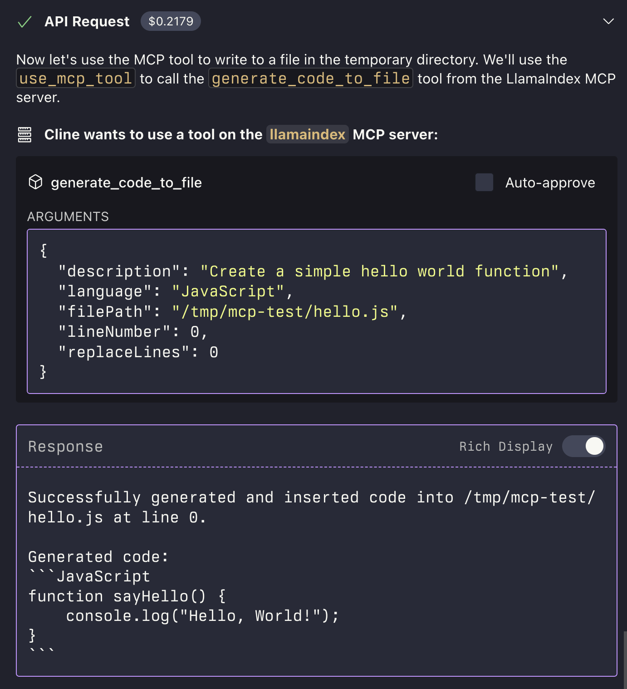
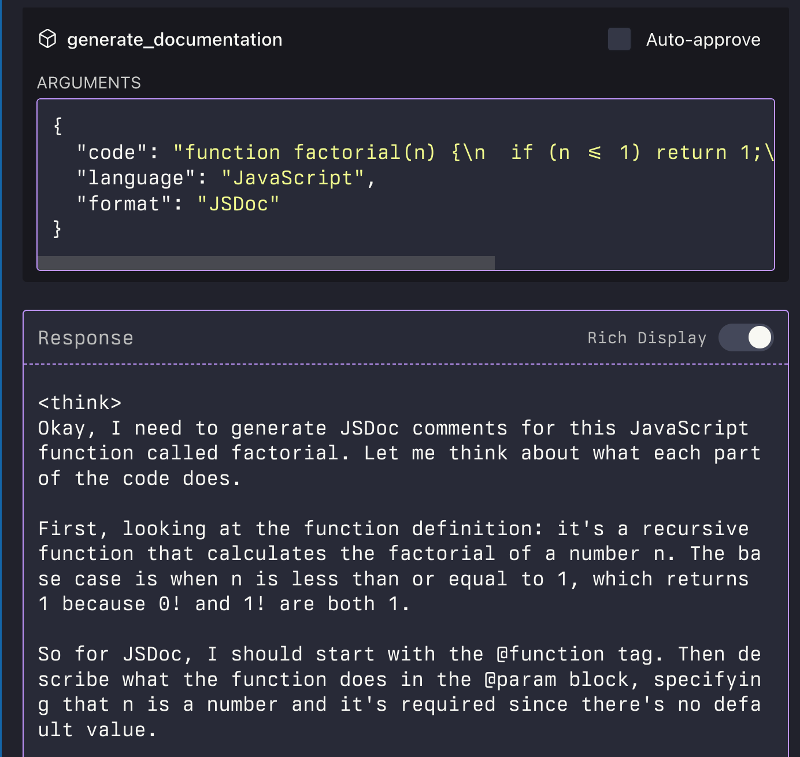

# MCP LLM

An MCP server that provides access to LLMs using the LlamaIndexTS library.

<a href="https://glama.ai/mcp/servers/i1gantlfrs">
  
</a>

## Features

This MCP server provides the following tools:

- `generate_code`: Generate code based on a description
- `generate_code_to_file`: Generate code and write it directly to a file at a specific line number
- `generate_documentation`: Generate documentation for code
- `ask_question`: Ask a question to the LLM




## Installation

Update your MCP config to add the mcp-llm server:

```json
{
  "mcpServers": {
    "llm": {
      "command": "npx",
      "args": [
        "-y",
        "mcp-llm"
      ],
      "env": {
        "LLM_MODEL_NAME": "deepseek-r1:7b-qwen-distill-q6_k_l",
        "LLM_MODEL_PROVIDER": "ollama",
        "LLM_BASE_URL": "http://localhost:11434",
        "LLM_ALLOW_FILE_WRITE": "true",
        "LLM_TIMEOUT_S": "240"
      },
      "disabled": false,
      "autoApprove": [
        "generate_code",
        "generate_documentation",
        "ask_question",
        "generate_code_to_file"
      ],
      "timeout": 300
    },
  }
}
```

## Available Scripts

- `npm run build` - Build the project
- `npm run watch` - Watch for changes and rebuild
- `npm start` - Start the MCP server
- `npm run example` - Run the example script
- `npm run inspector` - Run the MCP inspector

## Configuration

The MCP server is configurable using environment variables:

### Required Environment Variables

- `LLM_MODEL_NAME`: The name of the model to use (e.g., `qwen2-32b:q6_k`, `anthropic.claude-3-7-sonnet-20250219-v1:0`)
- `LLM_MODEL_PROVIDER`: The model provider (e.g., `bedrock`, `ollama`, `openai`, `openai-compatible`)

### Optional Environment Variables

- `LLM_BASE_URL`: Base URL for the model provider (e.g., `https://ollama.internal`, `http://my-openai-compatible-server.com:3000/v1`)
- `LLM_TEMPERATURE`: Temperature parameter for the model (e.g., `0.2`)
- `LLM_NUM_CTX`: Context window size (e.g., `16384`)
- `LLM_TOP_P`: Top-p parameter for the model (e.g., `0.85`)
- `LLM_TOP_K`: Top-k parameter for the model (e.g., `40`)
- `LLM_MIN_P`: Min-p parameter for the model (e.g., `0.05`)
- `LLM_REPETITION_PENALTY`: Repetition penalty parameter for the model (e.g., `1.05`)
- `LLM_SYSTEM_PROMPT_GENERATE_CODE`: System prompt for the generate_code tool
- `LLM_SYSTEM_PROMPT_GENERATE_DOCUMENTATION`: System prompt for the generate_documentation tool
- `LLM_SYSTEM_PROMPT_ASK_QUESTION`: System prompt for the ask_question tool
- `LLM_TIMEOUT_S`: Timeout in seconds for LLM requests (e.g., `240` for 4 minutes)
- `LLM_ALLOW_FILE_WRITE`: Set to `true` to allow the `generate_code_to_file` tool to write to files (default: `false`)
- `OPENAI_API_KEY`: API key for OpenAI (required when using OpenAI provider)


## Manual Install From Source

1. Clone the repository
2. Install dependencies:

```bash
npm install
```

3. Build the project:

```bash
npm run build
```

4. Update your MCP configuration

### Using the Example Script

The repository includes an example script that demonstrates how to use the MCP server programmatically:

```bash
node examples/use-mcp-server.js
```

This script starts the MCP server and sends requests to it using curl commands.

## Examples

### Generate Code

```json
{
  "description": "Create a function that calculates the factorial of a number",
  "language": "JavaScript"
}
```

### Generate Code to File

```json
{
  "description": "Create a function that calculates the factorial of a number",
  "language": "JavaScript",
  "filePath": "/path/to/factorial.js",
  "lineNumber": 10,
  "replaceLines": 0
}
```

The `generate_code_to_file` tool supports both relative and absolute file paths. If a relative path is provided, it will be resolved relative to the current working directory of the MCP server.

### Generate Documentation

```json
{
  "code": "function factorial(n) {\n  if (n <= 1) return 1;\n  return n * factorial(n - 1);\n}",
  "language": "JavaScript",
  "format": "JSDoc"
}
```

### Ask Question

```json
{
  "question": "What is the difference between var, let, and const in JavaScript?",
  "context": "I'm a beginner learning JavaScript and confused about variable declarations."
}
```

## License

- [MIT LICENSE](LICENSE)